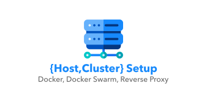

# Basic Host Setup

<div align="center">
  
</div>

Script to make initial configurations of Docker, Docker Compose and Reverse Proxy (Traefik or NGINX) on servers in Digital Ocean, Linone, AWS EC2 or similar.

Performs the following configuration steps:

* Definition of timezone
* root user settings
* Adds new default user for full privilege deploy
* Install git, zip, unzip, curl, acl, docker and docker-compose
* Adds github, gitlab and bitbucket to trusted hosts

Tested on a VPS running Ubuntu Server 20.04 LTS with 4GB RAM, but can be used in similar distributions.

## Installation

To do the setup, download and run the script `setup-vps.sh` or if you prefer (proceed at your own risk), execute the instruction below.

```
wget -qO- https://raw.githubusercontent.com/fabioassuncao/setup-vps/master/setup-vps.sh | bash -s -- \
--timezone America/Sao_Paulo \
--root-password your_secure_password \
--default-user cubed \
--default-password your_secure_password \
--workdir /home/cubed \
--spaces apps,backups \
--docker-networks nginx-proxy,internal \
--boilerplate nginx \
--additional-apps mysql,postgres,redis,whoami,adminer,phpmyadmin,portainer \
--domain yourdomain.com \
--email email@yourdomain.com \
--services-password your_secure_password
```

## Command options

You can get help by passing the `-h` option.

~~~
Script for initial configurations of Docker, Docker Compose and Reverse Proxy.
USAGE:
    wget -qO- https://raw.githubusercontent.com/fabioassuncao/setup-vps/master/setup-vps.sh | bash -s -- [OPTIONS]
OPTIONS:

-t|--timezone               Standard system timezone
--docker-compose-version    Version of the docker compose to be installed
--root-password             New root user password. The script forces the password update
--default-user              Alternative user (with super powers) that will be used for deploys and remote access later
--default-password
--workdir                   Folder where all files of this setup will be stored
--spaces                    Subfolders where applications will be allocated
-n|--docker-networks        Docker networks to be created
-b|--boilerplate            Proxy templates to be installed. Currently traefik and nginx are available
-a|--additional-apps        Additional applications that will be installed along with the proxy
-d|--domain                 If you have configured your DNS and pointed A records to this host, this will be the domain used to access the services
                            After everything is set up, you can access the services as follows: service.yourdomain.com
-e|--email                  Email that Let's Encrypt will use to generate SSL certificates
--ssh-passphrase            Provides a passphrase for the ssh key

OPTIONS (Service Credentials):
--services-password         New services password (MySQL, PostgreSQL, Redis)

OPTIONS (Webhook):
--webhook-url               Ping URL With Provisioning Updates
~~~

## Important
In order for you to be able to deploy applications using git and some deployment tools such as the [deployer](https://deployer.org/), you will need to add the public key (id_rsa.pub) of the user created on your VCS server (bitbucket, gitlab, github, etc.).

## Tips

To not have to enter the password every time you need to access the remote server by SSH or have to do some deploy, type the command below. This will add your public key to the new user's ```authorized_keys``` file.

```
ssh-copy-id <USERNAME>@<SERVER IP>
```

### Reverse Proxy

If you are looking for a boilerplate for fast configuration of docker containers for reverse proxy, automatic configuration of virtualhosts and generation of SSL certificates with Let's Encrypt, see the repositories:

 * [fabioassuncao/docker-boilerplate-traefik-proxy](https://github.com/fabioassuncao/docker-boilerplate-traefik-proxy)

 * [fabioassuncao/docker-boilerplate-nginx-proxy](https://github.com/fabioassuncao/docker-boilerplate-nginx-proxy)

## Contributing

1. Fork this repository!
2. Create your feature from the **develop** branch: git checkout -b feature/my-new-feature
3. Write and comment your code
4. Commit your changes: `git commit -am 'Add some feature'`
5. Push the branch: `git push origin feature/my-new-feature`
6. Make a pull request to the branch **develop**

## Credits

* [Fábio Assunção](https://github.com/fabioassuncao)
* [All Contributors](../../contributors)


## License

Licensed under the MIT License.
