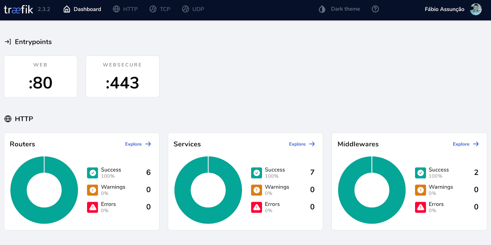

# Traefik Proxy

  

Template for quick configuration of Docker containers for reverse proxy with [Traefik v2.x](https://github.com/containous/traefik), automatic configuration of virtualhosts and generation of SSL certificates with Let's Encrypt.

## Requirements

* Docker 19.03 or higher
* Docker Compose 1.27 or higher
* apache2-utils latest version

## Installation

1. [Download](https://github.com/cubedserver/docker-traefik-proxy/archive/main.zip) the latest version
2. Generate a password for the Traefik admin user: `htpasswd -nb admin your_secure_password`
3. Edit the traefik_dynamic.toml file and update with the generated password
4. Create a new Docker network called `web`
5. Create a new Docker network called `internal`
6. Create an empty file that will hold your Let’s Encrypt information: `touch acme.json ; chmod 600 acme.json`
7. Running the Traefik Container: `docker-compose up -d`

## Tips

If you are looking for a script for initial server settings on DigitalOcean, Linone, AWS EC2 or similar, see the repository [cubedserver/server-setup](https://github.com/cubedserver/server-setup)

## Contributing

1. Fork this repository!
2. Create your feature from the **develop** branch: git checkout -b feature/my-new-feature
3. Write and comment your code
4. Commit your changes: `git commit -am 'Add some feature'`
5. Push the branch: `git push origin feature/my-new-feature`
6. Make a pull request to the branch **develop**

## Credits

* [Fábio Assunção](https://github.com/fabioassuncao)
* [All Contributors](../../contributors)

## License

Licensed under the MIT License.